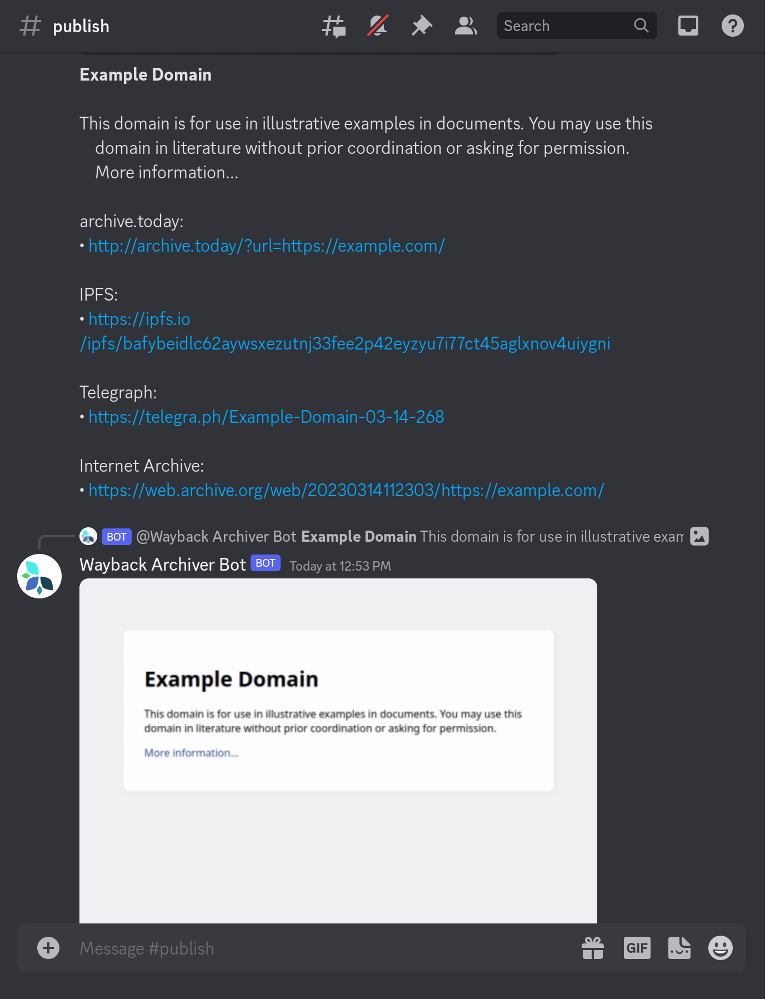
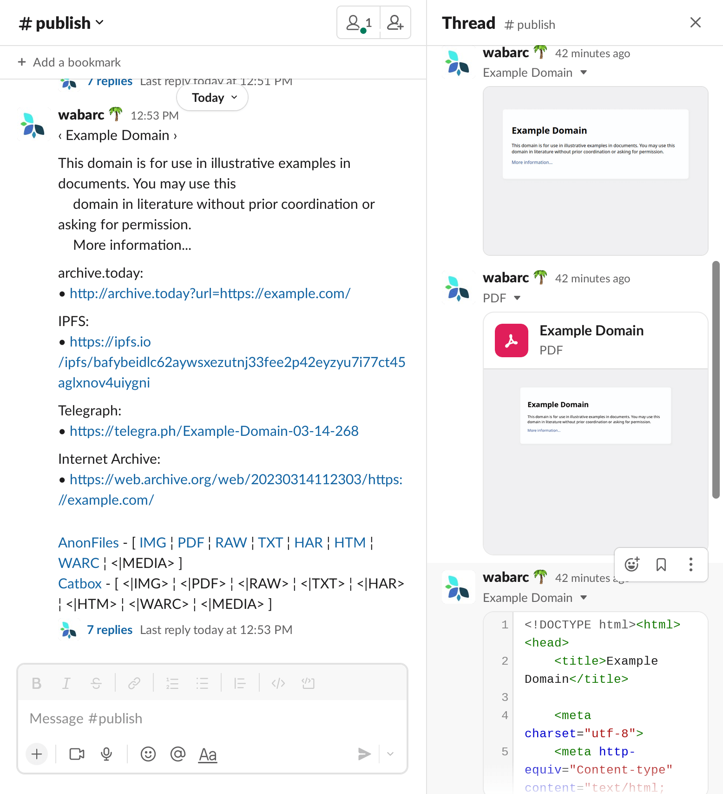

# Wayback

[](https://github.com/wabarc/wayback/blob/main/LICENSE)
[](https://goreportcard.com/report/github.com/wabarc/wayback)
[](https://codecov.io/gh/wabarc/wayback)
[](https://pkg.go.dev/github.com/wabarc/wayback)
[](https://github.com/wabarc/wayback/releases)

[](https://t.me/wabarc_bot)
[](https://discord.com/api/oauth2/authorize?client_id=863324809206169640&permissions=2147796992&scope=bot%20applications.commands)
[](https://matrix.to/#/@wabarc_bot:matrix.org)
[](https://matrix.to/#/#wabarc:matrix.org)
[](http://wabarcoww2bxmdbixj7sjwggv3fonh2rpflfiildegcydk5udkdckdyd.onion/)
[](https://wabarc.eu.org/)
[](https://iris.to/#/profile/npub1gm4xeu8wlt6aa56zenutkwa0ppjng5axsscv424d0xvv5jalxxzs4hjukz)

Wayback is a web archiving and playback tool that allows users to capture and preserve web content. It provides an IM-style interface for receiving and presenting archived web content, and a search and playback service for retrieving previously archived pages. Wayback is designed to be used by web archivists, researchers, and anyone who wants to preserve web content and access it in the future.

## Features

- Free and open-source
- Expose prometheus metrics
- Cross-platform compatibility
- Batch wayback URLs for faster archiving
- Built-in CLI (`wayback`) for convenient use
- Serve as a Tor Hidden Service or local web entry for added privacy and accessibility
- Easier wayback to Internet Archive, archive.today, IPFS and Telegraph integration
- Interactive with IRC, Matrix, Telegram bot, Discord bot, Mastodon, Twitter, and XMPP as a daemon service for convenient use
- Supports publishing wayback results to Telegram channel, Mastodon, and GitHub Issues for sharing
- Supports storing archived files to disk for offline use
- Download streaming media (requires [FFmpeg](https://ffmpeg.org/)) for convenient media archiving.

## Getting Started

For a comprehensive guide, please refer to the complete [documentation](https://docs.wabarc.eu.org/).

### Installation

The simplest, cross-platform way is to download from [GitHub Releases](https://github.com/wabarc/wayback/releases) and place the executable file in your PATH.

From source:

```sh
go install github.com/wabarc/wayback/cmd/wayback@latest
```

From GitHub Releases:

```sh
curl -fsSL https://get.wabarc.eu.org | sh
```

or via [Bina](https://bina.egoist.dev/):

```sh
curl -fsSL https://bina.egoist.dev/wabarc/wayback | sh
```

Using [Snapcraft](https://snapcraft.io/wayback) (on GNU/Linux)

```sh
sudo snap install wayback
```

Via [APT](https://repo.wabarc.eu.org/deb:wayback):

```bash
curl -fsSL https://repo.wabarc.eu.org/apt/gpg.key | sudo gpg --dearmor -o /usr/share/keyrings/packages.wabarc.gpg
echo "deb [arch=amd64,arm64,armhf signed-by=/usr/share/keyrings/packages.wabarc.gpg] https://repo.wabarc.eu.org/apt/ /" | sudo tee /etc/apt/sources.list.d/wayback.list
sudo apt update
sudo apt install wayback
```

Via [RPM](https://repo.wabarc.eu.org/rpm:wayback):

```bash
sudo rpm --import https://repo.wabarc.eu.org/yum/gpg.key
sudo tee /etc/yum.repos.d/wayback.repo > /dev/null <<EOT
[wayback]
name=Wayback Archiver
baseurl=https://repo.wabarc.eu.org/yum/
enabled=1
gpgcheck=1
gpgkey=https://repo.wabarc.eu.org/yum/gpg.key
EOT

sudo dnf install -y wayback
```

Via [Homebrew](https://github.com/wabarc/homebrew-wayback):

```shell
brew tap wabarc/wayback
brew install wayback
```

### Usage

#### Command line

```sh
$ wayback -h

A command-line tool and daemon service for archiving webpages.

Usage:
  wayback [flags]

Examples:
  wayback https://www.wikipedia.org
  wayback https://www.fsf.org https://www.eff.org
  wayback --ia https://www.fsf.org
  wayback --ia --is -d telegram -t your-telegram-bot-token
  WAYBACK_SLOT=pinata WAYBACK_APIKEY=YOUR-PINATA-APIKEY \
    WAYBACK_SECRET=YOUR-PINATA-SECRET wayback --ip https://www.fsf.org

Flags:
      --chatid string      Telegram channel id
  -c, --config string      Configuration file path, defaults: ./wayback.conf, ~/wayback.conf, /etc/wayback.conf
  -d, --daemon strings     Run as daemon service, supported services are telegram, web, mastodon, twitter, discord, slack, irc, xmpp
      --debug              Enable debug mode (default mode is false)
  -h, --help               help for wayback
      --ia                 Wayback webpages to Internet Archive
      --info               Show application information
      --ip                 Wayback webpages to IPFS
      --ipfs-host string   IPFS daemon host, do not require, unless enable ipfs (default "127.0.0.1")
  -m, --ipfs-mode string   IPFS mode (default "pinner")
  -p, --ipfs-port uint     IPFS daemon port (default 5001)
      --is                 Wayback webpages to Archive Today
      --ph                 Wayback webpages to Telegraph
      --print              Show application configurations
  -t, --token string       Telegram Bot API Token
      --tor                Snapshot webpage via Tor anonymity network
      --tor-key string     The private key for Tor Hidden Service
  -v, --version            version for wayback
```

#### Examples

Wayback one or more url to *Internet Archive* **and** *archive.today*:

```sh
wayback https://www.wikipedia.org

wayback https://www.fsf.org https://www.eff.org
```

Wayback url to *Internet Archive* **or** *archive.today* **or** *IPFS*:

```sh
// Internet Archive
$ wayback --ia https://www.fsf.org

// archive.today
$ wayback --is https://www.fsf.org

// IPFS
$ wayback --ip https://www.fsf.org
```

For using IPFS, also can specify a pinning service:

```sh
$ export WAYBACK_SLOT=pinata
$ export WAYBACK_APIKEY=YOUR-PINATA-APIKEY
$ export WAYBACK_SECRET=YOUR-PINATA-SECRET
$ wayback --ip https://www.fsf.org

// or

$ WAYBACK_SLOT=pinata WAYBACK_APIKEY=YOUR-PINATA-APIKEY \
$ WAYBACK_SECRET=YOUR-PINATA-SECRET wayback --ip https://www.fsf.org
```

More details about [pinning service](https://github.com/wabarc/ipfs-pinner).

With telegram bot:

```sh
wayback --ia --is --ip -d telegram -t your-telegram-bot-token
```

Publish message to your Telegram channel at the same time:

```sh
wayback --ia --is --ip -d telegram -t your-telegram-bot-token --chatid your-telegram-channel-name
```

Also can run with debug mode:

```sh
wayback -d telegram -t YOUR-BOT-TOKEN --debug
```

Both serve on Telegram and Tor hidden service:

```sh
wayback -d telegram -t YOUT-BOT-TOKEN -d web
```

URLs from file:

```sh
wayback url.txt
```

```sh
cat url.txt | wayback
```

#### Configuration Parameters

Look at the [full list of configuration options](docs/environment.md).

## Deployment

- [wabarc/on-heroku](https://github.com/wabarc/on-heroku)
- [wabarc/on-github](https://github.com/wabarc/on-github)
- [wabarc/on-render](https://github.com/wabarc/on-render)

### Docker/Podman

```sh
docker pull wabarc/wayback
docker run -d wabarc/wayback wayback -d telegram -t YOUR-BOT-TOKEN # without telegram channel
docker run -d wabarc/wayback wayback -d telegram -t YOUR-BOT-TOKEN -c YOUR-CHANNEL-USERNAME # with telegram channel
```

### 1-Click Deploy

**Note:** These are free hosting options. If you need a quick and simple setup, this method may be ideal.

[](https://heroku.com/deploy?template=https://github.com/wabarc/wayback)
<a href="https://render.com/deploy?repo=https://github.com/wabarc/on-render">
    
</a>

## Screenshots

<details><summary>Click to see screenshots of the services.</summary>

### Discord


### Web Service


### Mastodon


### Matrix


### IRC


### Slack


### Telegram


### XMPP


</details>

## Contributing

We encourage all contributions to this repository! Open an issue! Or open a Pull Request!

If you're interested in contributing to `wayback` itself, read our [contributing guide](./CONTRIBUTING.md) to get started.

Note: All interaction here should conform to the [Code of Conduct](./CODE_OF_CONDUCT.md).

## License

This software is released under the terms of the GNU General Public License v3.0. See the [LICENSE](https://github.com/wabarc/wayback/blob/main/LICENSE) file for details.

[](https://app.fossa.com/projects/custom%2B30014%2Fgithub.com%2Fwabarc%2Fwayback?ref=badge_large)
