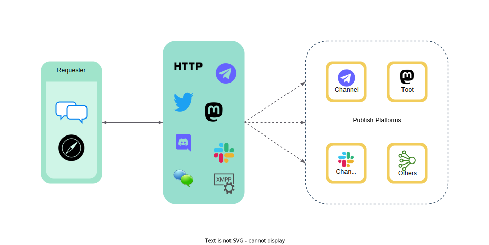

Wayback is a web archiving and replay tool that enables users to capturing and preserving web content. It provides an interface to crawl and archive the contents of the web, and a search and replay service to access previously archived pages. Wayback is designed to be used by web archivists, researchers, and anyone who wants to preserve web content and access it in the future.

Wayback is an open-source web archiving application written in Go. With a modular and customizable architecture, it is designed to be flexible and adaptable to various use cases and environments. It provides support for multiple storage backends and integration with other services.

Whether you need to archive a single web page or a large collection of websites, Wayback can help you capture and store web content for posterity. With its user-friendly interface and powerful features, Wayback is a valuable tool for anyone interested in web archiving and preservation.

## Features

- Free and open-source
- Expose prometheus metrics
- Cross-platform compatibility
- Batch wayback URLs for faster archiving
- Built-in CLI (`wayback`) for convenient use
- Serve as a Tor Hidden Service or local web entry for added privacy and accessibility
- Easier wayback to Internet Archive, archive.today, IPFS and Telegraph integration
- Interactive with IRC, Matrix, Telegram bot, Discord bot, Mastodon, Twitter, and XMPP as a daemon service for convenient use
- Supports publishing wayback results to Telegram channel, Mastodon, and GitHub Issues for sharing
- Supports storing archived files to disk for offline use
- Download streaming media (requires [FFmpeg](https://ffmpeg.org/)) for convenient media archiving.

## How it works

