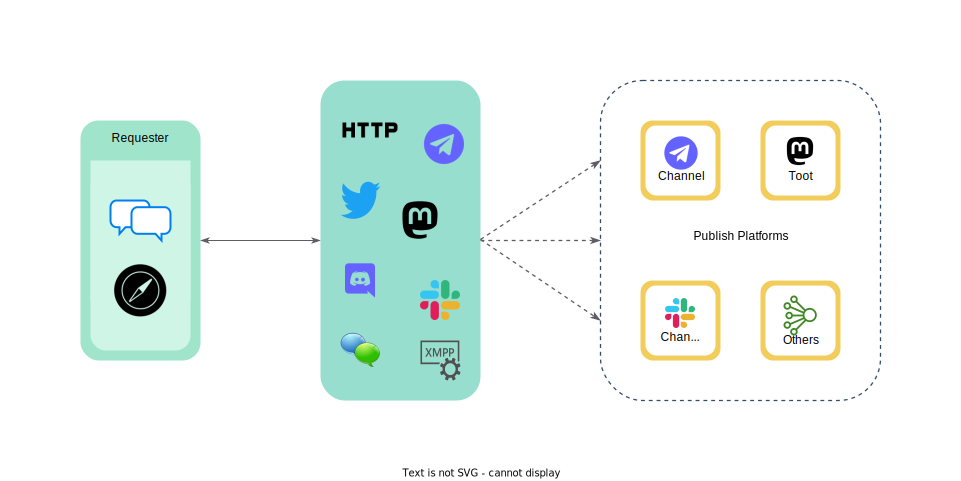

Wayback是一个网络存档和回放工具，可以帮助用户捕获和保存网络内容。它提供了一个会话界面，用于爬取和存档网络内容，以及一个搜索和回放服务，用于访问先前存档的页面。Wayback旨在供网络存档员、研究人员以及任何想要保存网络内容并在未来访问它的人使用。

Wayback是用Go编写的开源网络存档应用程序。具有模块化和可定制化的架构，它被设计成灵活和适应各种用例和环境。它提供了对多个存储后端的支持，并与其他服务集成。

无论您需要存档单个网页还是大量网站的集合，Wayback都可以帮助您为后人捕获和存储网络内容。凭借其用户友好的界面和强大的功能，Wayback是对网络存档和保护感兴趣的任何人都非常有价值的工具。

## 特性

- 完全开源
- 跨平台兼容
- 批量存档URL以加快存档速度
- 内置CLI工具（`wayback`）以便于使用
- 可作为Tor隐藏服务或本地Web入口，增加隐私和可访问性
- 更容易地集成到Internet Archive、archive.today、IPFS和Telegraph中
- 可与IRC、Matrix、Telegram机器人、Discord机器人、Mastodon和Twitter进行交互，作为守护进程服务，以便于使用
- 支持将存档结果发布到Telegram频道、Mastodon和GitHub Issues中进行共享
- 支持将存档文件存储到磁盘中以供离线使用
- 下载流媒体（需要[FFmpeg](https://ffmpeg.org/)）以便于媒体存档。

## 工作原理

