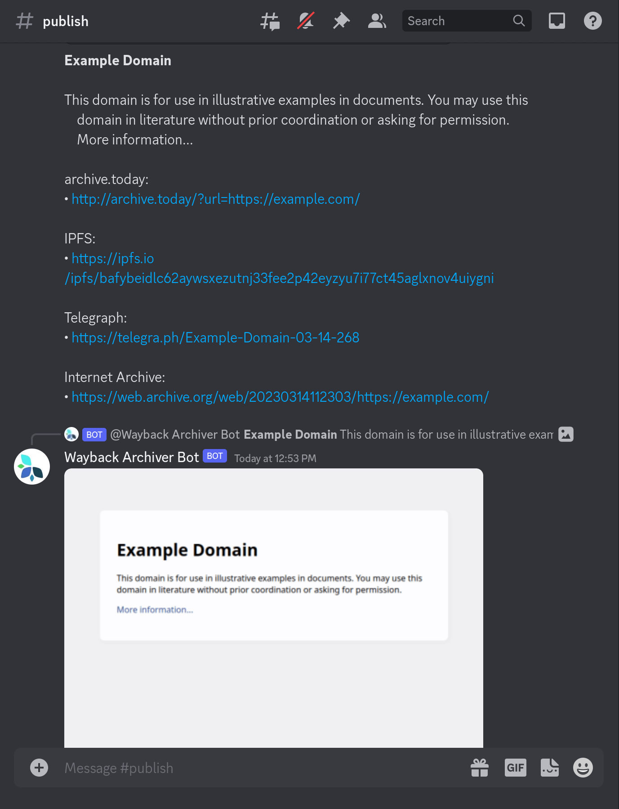

## 如何构建一个Discord机器人

构建一个Discord机器人，您需要按照以下步骤进行：

在`OAuth2 - SCOPES`部分启用`bot`和`applications.commands`范围，创建一个[Discord应用程序](https://discord.com/developers/applications)。确保授予机器人`发送消息`和`附加文件`的权限。

配置Discord机器人以支持以下斜线命令：

1. `/help` - 显示帮助信息（*需要配置帮助文本*）
2. `/metrics` - 显示服务指标（*需要启用指标*）
3. `/playback` - 播放URL

为配置Discord守护程序服务设置以下环境变量：

1. `WAYBACK_DISCORD_TOKEN`（必填）
2. `WAYBACK_DISCORD_CHANNEL`
3. `WAYBACK_DISCORD_HELPTEXT`

有关如何创建和配置Discord机器人的详细文档，请参阅[Discord开发人员门户网站](https://discord.com/developers/docs/intro)。

