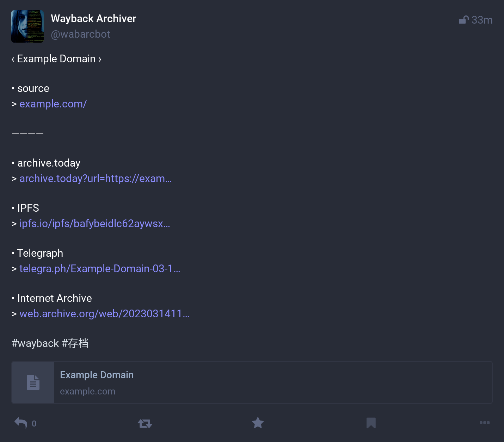

## How to build a Mastodon Bot

You can choose any Mastodon instance. Here, we will be using Mastodon.social as an example.

To create a Mastodon application, you can follow these steps:

1. Log in to your Mastodon account.
2. Go to "Settings" > "[Development](https://mastodon.social/settings/applications)" > "[New Application](https://mastodon.social/settings/applications/new)".
3. Enter the following information:
    - **Application name**: The name of your application.
    - **Application website**: The website associated with your application.
    - **Redirect URI**: The URI where users will be redirected after authentication. This can be any valid URI, but it must match the redirect URI specified in your code.
    - Scopes: The scopes your application requires. These determine the actions your application can perform on behalf of the user. The required minimum scopes are: `read:statuses`, `read:notifications`, `write:statuses`, `write:notifications` and `write:conversations`.
4. Click "Submit".
5. On the next page, you will see your application's client ID and client secret. These will be needed to authenticate your application.

You can find more information about creating Mastodon applications in the Mastodon documentation: https://docs.joinmastodon.org/client/token/

## Configuration

After creating a Mastodon application, you can find the `Client key`, `Client secret`, and `Your access token` on the application details page.

Next, place these keys in the environment or configuration file:

The next step, place them below key on env or config file:

- `WAYBACK_MASTODON_KEY`: Client key
- `WAYBACK_MASTODON_SECRET`: Client secret
- `WAYBACK_MASTODON_TOKEN`: Your access token

Additionally, you must specify the Mastodon server by setting the `WAYBACK_MASTODON_SERVER` variable.

## Further reading

- [Fediverse Observer](https://mastodon.fediverse.observer/list)
