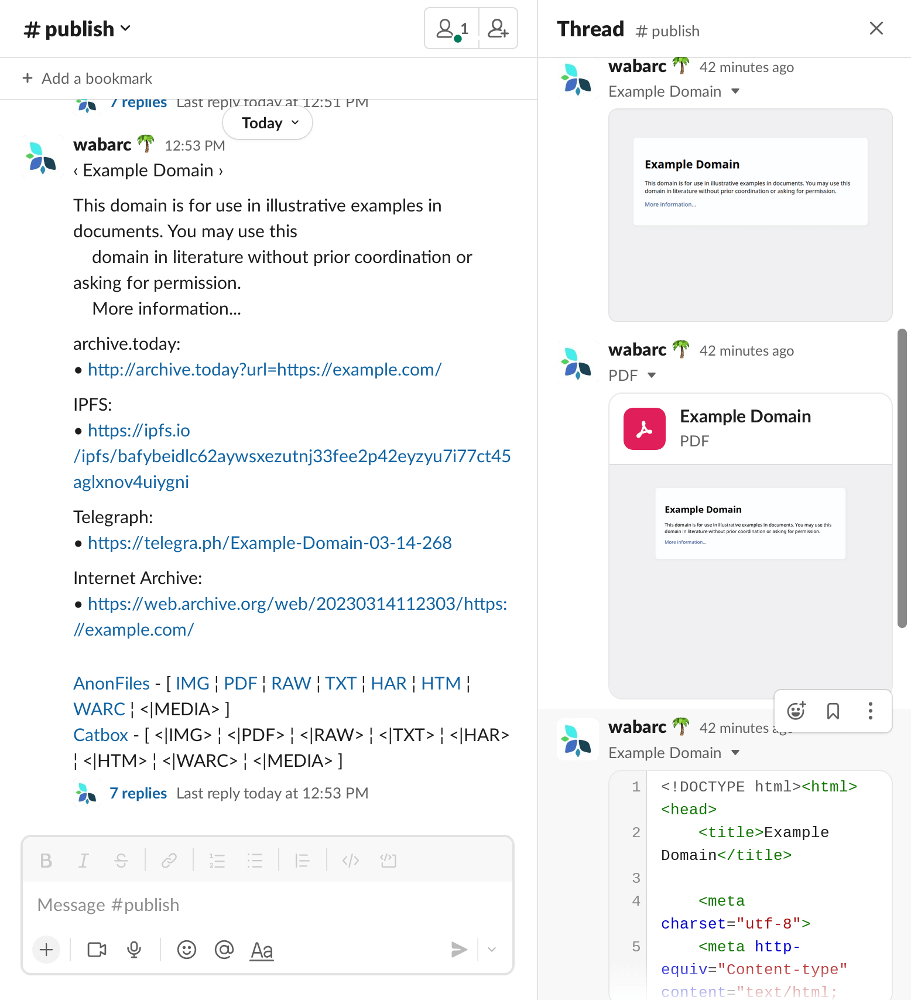

## 如何构建一个Slack App

创建新应用的步骤如下：

1. 打开[Slack API](https://api.slack.com/apps)。
2. 点击“创建新应用”和“从头开始”。
2. 生成具有`connections:write`范围的应用级令牌。
3. 启用Socket模式。
4. 启用事件
    - 订阅机器人事件：`app_mention`和`message.im`。
    - 代表用户订阅事件：`message.im`。
5. 设置OAuth和权限用户令牌范围：`chat:write`，`files:write`。
6. 将应用程序安装到您的工作区，并获取`Bot User OAuth Token`。
7. 在“应用主页”部分，勾选“允许用户从消息选项卡发送斜杠命令和消息”。
8. 可选地，创建一个用于发布的频道，并通过查看频道详情记录`Channel ID`。

## 配置

创建新应用后，您将获得`Bot User OAuth Token`和`Channel ID`。

接下来，将这些密钥放置在环境或配置文件中：

- `WAYBACK_SLACK_BOT_TOKEN`：Bot User OAuth Token。
- `WAYBACK_SLACK_CHANNEL`：用于发布的频道ID（可选）。
- `WAYBACK_SLACK_HELPTEXT`：提供帮助消息供用户参考（可选）。

## 相关资料

- [Slack API文档](https://api.slack.com/)
